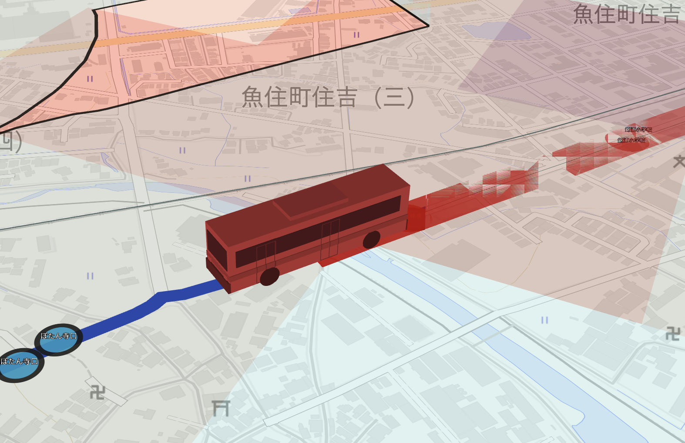
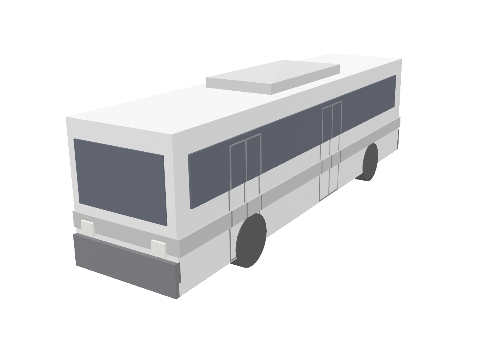
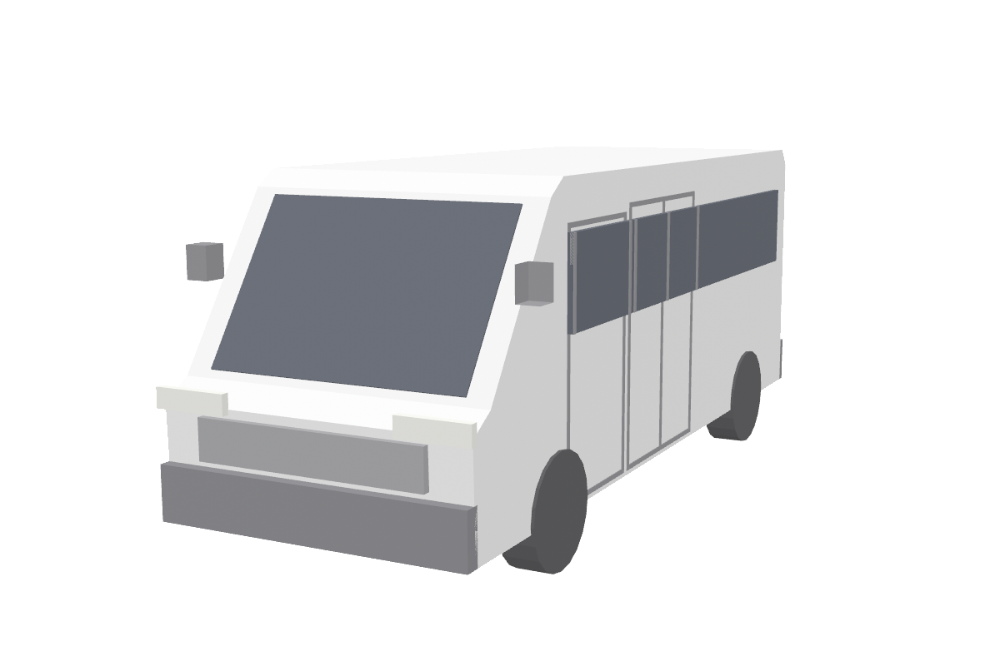
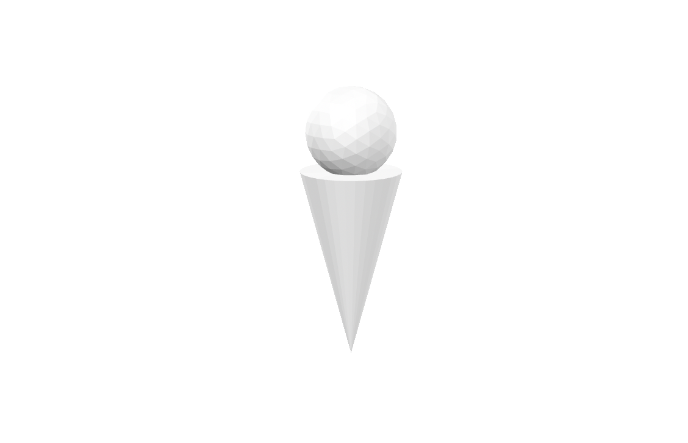
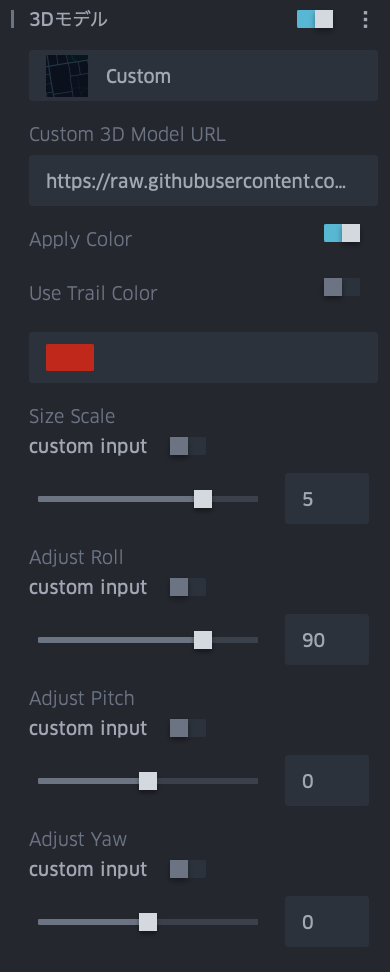

# 3Dモデルの追加

Kepler.glで3Dモデルを表示するための設定と活用方法。

## Kepler.glの3Dモデルの表示機能

> ver. 3.3.0-alpha.6 時点の情報です。

Kepler.gl は 2D の地図表示に加え、いくつかの方法で立体（3D）表現をサポートしています。基盤となる描画エンジンは deck.gl / WebGL であり、地図を傾けた3Dビューの上に各種の立体レイヤーを重ねられます。3Dに関わる主な機能は次のとおりです。

### 1. 3Dビュー（地図の傾き・回転）

地図を傾ける（pitch）・回転する（bearing）ことで、俯瞰の3Dパースで表示できます。後述の地形・建物・立体レイヤー・3Dモデルは、この3Dビューと組み合わせることで立体感が得られます。

### 2. 3D建物（3D Buildings）

ベースマップのスタイルに含まれる建物フットプリントを高さ付きで立体表示する機能です。レイヤーを追加せずマップスタイル側の設定として描画されます（3.0.0 系でレンダリング方式が整理され、3.1.0 からはポリゴンレイヤーのドロップダウンでも「3D buildings」を選択可能になりました）。

### 3. カラム（Column）による高さ表現

集計系レイヤー（Hexbin / Grid / H3 など）や Point のカラム表示では、集計値や属性に応じて**高さ（Height / Elevation）**を持たせ、3D の柱として押し出し（extrude）表示できます。「Enable Height」等のトグルと高さスケールで調整します。

### 4. Tripレイヤーの3Dモデル（glTF）

移動オブジェクト（アニメーションする軌跡）に対して、**glTF 形式の3Dモデル**を割り当てて表示できる機能です。deck.gl の ScenegraphLayer を基盤としており（kepler.gl 3.0.0 系で ScenegraphLayer を導入）、車両・航空機・人などのモデルを軌跡に沿って動かせます。内蔵のモデルライブラリから選ぶか、独自の glTF/GLB ファイルを URL で指定できます。設定方法は次章を参照してください。

| 項目 | 内容 |
|---|---|
| 対応形式 | .gltf（JSON/ASCII）／ .glb（バイナリ） |
| モデル指定 | 内蔵ライブラリ、または Custom で自前モデルの URL を指定 |
| 要件 | ホスト側で **CORS を有効化**しておく必要がある |
| 性能上の注意 | ポリゴン数の多い高精細モデルは描画が大幅に遅くなることがある |

### 5. 3Dタイル（3D Tile レイヤー）

フォトグラメトリのメッシュ、建物、地形などの3Dコンテンツを配信タイルとして読み込む専用レイヤーです。**OGC 3D Tiles / Google Photorealistic 3D Tiles / Cesium Ion / ArcGIS I3S** をサポートします。都市全体のリアルな3D表現などに利用できます。

### 6. グローブ表示（Globe View）

比較的新しい 3.3.0 系で追加された、地球を球体として描画するグローブビューモードです（大気のハロー表現やレイヤーブレンディング等を含む）。

### 3D関連機能の追加履歴（リリースノートより）

| 機能 | 主な導入・更新バージョン | 時期 |
|---|---|---|
| 3D建物のレンダリング整理 | 3.0.0-alpha.0 | 2022-11 |
| ScenegraphLayer（3Dモデルの基盤） | 3.0.0-alpha.1〜 | 2023-10〜 |
| ポリゴンドロップダウンに 3D buildings 追加 | 3.1.0-alpha.1 | 2024-12 |
| 3Dタイル / グローブ等の拡充 | 3.3.0 系 | 2026 |

> 注: UI 上の項目名・操作は、kepler.gl をベースとする Foursquare Studio のドキュメントに準拠しています。オープンソース版のバージョンによっては、内蔵モデルライブラリ等の一部 UI が異なる場合があります。

## Tripsレイヤーの3Dモデルの設定方法

### 3Dモデル素材

Tripレイヤーの「3D Model → Custom」に、以下の glTF/GLB モデルの URL を指定して利用できます。いずれも本リポジトリの `3dmodels/` 配下に置いた自作モデルで、GitHub raw（`raw.githubusercontent.com`）経由で配信されます。GitHub raw は CORS が有効（`Access-Control-Allow-Origin: *`）なため、kepler.gl から直接読み込めます。

> 注: 下記 URL は `main` ブランチの内容を参照します。モデルを追加・更新した場合は、コミットして push しないと反映されません。

#### バス（Bus）

- **URL**: `https://raw.githubusercontent.com/amane-ltd/keplergl-resources/refs/heads/main/3dmodels/bus.glb`
- **作者**: 株式会社AMANE（自作モデル）
- **ライセンス**: Creative Commons Attribution 4.0（CC BY 4.0）— 公開・配布時は **「株式会社AMANE」** のクレジット表記が必要
- **形式**: glTF 2.0 バイナリ（`.glb`）／ 低ポリゴン（trimesh 生成。body・windows・stripe・windshield などの複数メッシュ）
- **ファイルサイズ**: 約 23 KB（軽量、多数配置にも向く）
- **CORS**: 有効（GitHub raw 配信：`Access-Control-Allow-Origin: *`）
- **用途例**: バス・車両の移動軌跡（Tripレイヤー）に沿って走らせる3Dモデルとして

> 使い方: Tripレイヤーの設定パネルで **3D Model** を「Custom」にし、上記 URL を貼り付けます。モデルの大きさは **Size Scale**、進行方向の傾きは **Roll / Pitch / Yaw Based On** で調整します（詳細は前項参照）。

#### ハイエース(HiACE)

ハイエース風の箱型バン。既存のバスとテイストを揃えた低ポリの自作モデルです。

- **URL**: `https://raw.githubusercontent.com/amane-ltd/keplergl-resources/refs/heads/main/3dmodels/hiace.glb`
- **作者**: 株式会社AMANE（自作モデル）
- **ライセンス**: Creative Commons Attribution 4.0（CC BY 4.0）— 公開・配布時は **「株式会社AMANE」** のクレジット表記が必要
- **形式**: glTF 2.0 バイナリ（`.glb`）／ 低ポリゴン（trimesh 生成。body・windows・windshield・rear_glass などの複数メッシュ）
- **ファイルサイズ**: 約 22 KB（軽量、多数配置にも向く）
- **CORS**: 有効（GitHub raw 配信：`Access-Control-Allow-Origin: *`）
- **用途例**: 配送・営業車などの移動軌跡（Tripレイヤー）に沿って走らせる3Dモデルとして

#### 人型ピン(Pin Person)

球（頭）＋円錐（胴）を組み合わせたチェスのポーン型の人型ピン。極小サイズで、多数配置しても軽快に動きます。

- **URL**: `https://raw.githubusercontent.com/amane-ltd/keplergl-resources/refs/heads/main/3dmodels/pin_person.glb`
- **作者**: 株式会社AMANE（自作モデル）
- **ライセンス**: Creative Commons Attribution 4.0（CC BY 4.0）— 公開・配布時は **「株式会社AMANE」** のクレジット表記が必要
- **形式**: glTF 2.0 バイナリ（`.glb`）／ 低ポリゴン（trimesh 生成。単一メッシュ）
- **ファイルサイズ**: 約 7 KB（超軽量）
- **CORS**: 有効（GitHub raw 配信：`Access-Control-Allow-Origin: *`）
- **用途例**: 人・歩行者・訪問先などの移動軌跡（Tripレイヤー）を表す人型ピンとして

### 手順

1. **軌跡データを用意する**
   移動を表すデータ（Tripレイヤー用）を用意します。GeoJSON の LineString で各座標に4要素目としてタイムスタンプを持たせた形式、または「経度・緯度・時刻」を持つ point データを使います。

2. **データを読み込む**
   kepler.gl の「Add Data」からデータを追加します。

3. **Tripレイヤーを作成する**
   レイヤーを追加し、レイヤータイプを **Trip** に設定します。ジオメトリ（軌跡）と時刻カラムが正しく割り当てられていることを確認します。時刻が認識されると、アニメーション（時間）コントロールが表示されます。

4. **地図を3Dビューにする**
   3Dモデルは平面では立体が分かりにくいため、地図を傾け（pitch）ます。画面右上の 3D/2D 切り替え、またはマップ操作（右ドラッグ等）で俯瞰のパースにします。

5. **3Dモデルを割り当てる**
   Tripレイヤーの設定で **3D Model** を **Custom** にし、素材のモデルURL（前項「3Dモデル素材」参照）を貼り付けます。読み込まれると軌跡に沿ってモデルが移動します。

6. **詳細設定を行う**
   モデルを正しく見やすく表示するため、以下を必ず設定します。

   - **Apply Color を有効にする** — 有効化してモデルの色を調整します（軌跡の色を適用する／任意の色を指定する）。
   - **Size Scale を 5 倍前後にする** — モデルは実寸大のため、地図の縮尺では小さく見えます。Size Scale を 5 倍前後に上げて視認できる大きさにします（対象の縮尺・モデルに応じて微調整）。
   - **Adjust Roll を 90 にする** — モデルの姿勢が横倒しになるため、Adjust Roll を 90 に設定して直立・進行方向に合わせます。

  

7. **アニメーションを再生する**
   時間（アニメーション）コントロールの再生ボタンでモデルを動かし、必要に応じて再生速度・Trail Length を調整します。

