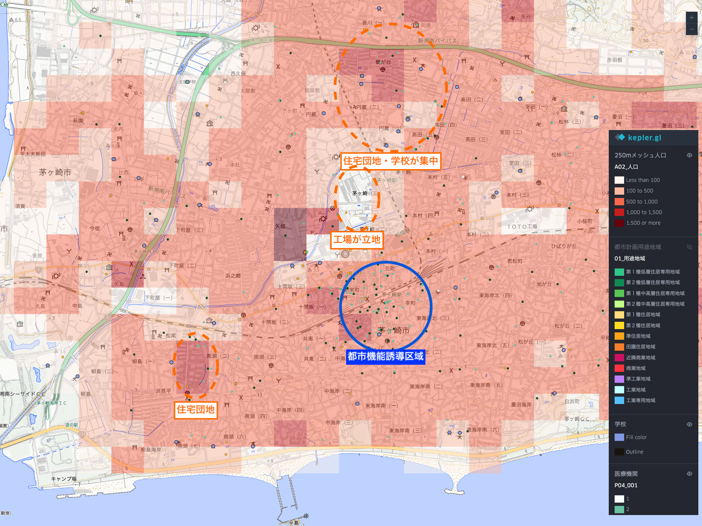
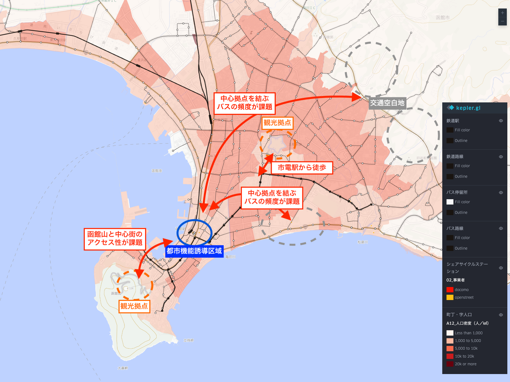
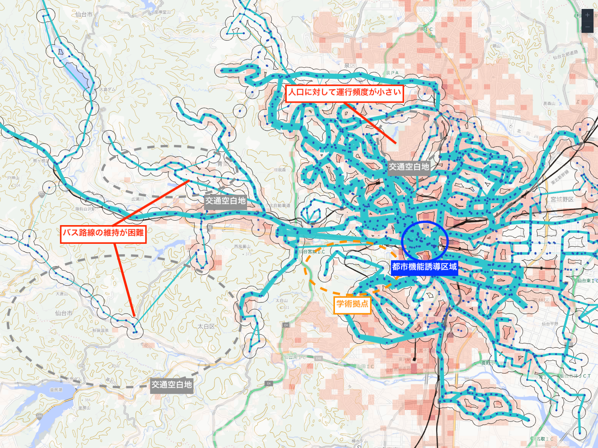
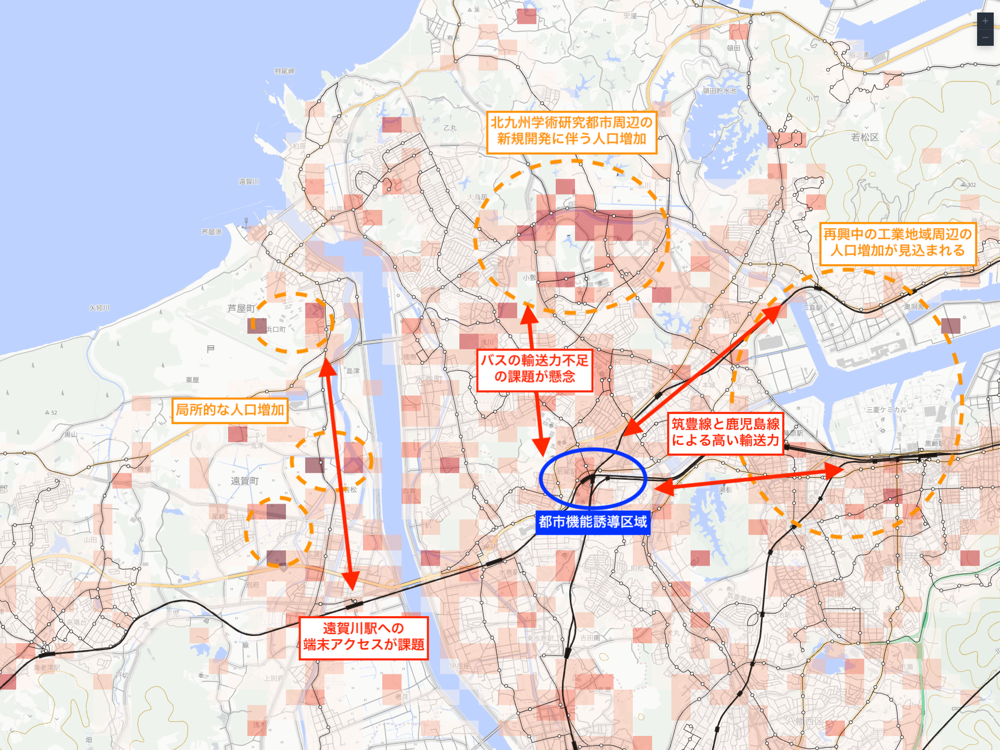

# 地域公共交通アップデートの実践

## 「地域公共交通計画の『アップデートガイダンス Ver1.0』」とは？

地域公共交通計画は、地域交通の目指す姿とその実現に向けた道筋を示す指針であり、まちづくり・福祉・教育・観光など他分野との連携のもと、関係者が共通認識を持ち協働を促す「司令塔」としての役割を担う。

「アップデートガイダンス Ver1.0」は、地域公共交通計画の作成・改訂にあたり、人口分布や交通ネットワークなどのモビリティデータを活用した現状診断やKPI・目標値の設定といった新しいアプローチを取り入れた計画作成の手順と、データの取得・活用方法をまとめたものである。

詳しくは[地域交通のためのポータルサイト「MOBILITY UPDATE PORTAL」](https://mobility-update.mlit.go.jp/)を参照。

本ページでは、アップデートガイダンスの概要版で示されたデータ活用の手順に沿って、Kepler.glで利用可能なベクタータイルやオープンデータを用いた可視化の方法を紹介する。

## 作成手順

1. 各ユースケースごとのサンプルマップのURLをコピー
2. [kepler.gl](https://kepler.gl/demo)を開く
3. `Add Data` > `Load Map using URL`で、コピーしたURLをペースト

## 1. 「人口情報」と「地域特性情報」を重ね合わせましょう（概要版 P4）

### 重ね合わせのイメージ (例: 神奈川茅ヶ崎市)

### サンプルマップのURL

`https://raw.githubusercontent.com/amane-ltd/keplergl-resources/refs/heads/main/samplemaps/demomap01.json` 

### 活用データの一覧

| データ内容 | 取得先 |
|-----------|--------|
| 総人口(A02_人口) | [メッシュ人口](vector-tiles.md#メッシュ人口) |
| 医療機関 | [国土数値情報 福祉施設データ](https://nlftp.mlit.go.jp/ksj/gml/datalist/KsjTmplt-P14-2023.html) |
| 学校 | [国土数値情報 学校データ](https://nlftp.mlit.go.jp/ksj/gml/datalist/KsjTmplt-P29-2023.html) |
| 市町村役場 | [国土数値情報 市町村役場等及び公的集会施設データ](https://nlftp.mlit.go.jp/ksj/gml/datalist/KsjTmplt-P05-2022.html) |

## 2. 「交通ネットワーク情報」を重ね合わせましょう（概要版 P5）

### 重ね合わせのイメージ

### サンプルマップのURL

`https://raw.githubusercontent.com/amane-ltd/keplergl-resources/refs/heads/main/samplemaps/demomap02.json` 

### 活用データの一覧

| データ内容 | 取得先 |
|-----------|--------|
| 鉄道駅 | [鉄道駅](vector-tiles.md#鉄道駅) |
| 鉄道路線 | [鉄道路線](vector-tiles.md#鉄道路線) |
| バス停留所 | [バス停留所](vector-tiles.md#バス停留所) |
| バス路線 | [バス路線](vector-tiles.md#バス路線) |
| シェアサイクルステーション（ステーション名・収容台数） | [シェアサイクルステーション](vector-tiles.md#シェアサイクルステーション) |
| 町丁目人口(A09_人口) | [町丁目人口](vector-tiles.md#町丁目人口) |

## 3. 「交通サービスの利用情報」を重ね合わせましょう（概要版 P6）

### 重ね合わせのイメージ(例: 宮城県仙台市)

### サンプルマップのURL

`https://raw.githubusercontent.com/amane-ltd/keplergl-resources/refs/heads/main/samplemaps/demomap03.json` 

### 活用データの一覧

| データ内容 | 取得先 |
|-----------|--------|
| 鉄道駅 | [鉄道駅](vector-tiles.md#鉄道駅) |
| 鉄道路線 | [鉄道路線](vector-tiles.md#鉄道路線) |
| バスの停留所 | [仙台市交通局GTFS](https://ckan.odpt.org/dataset/sendai_municipal_bus_realtime_information)から[GTFS-Cooker](https://amane-ltd.github.io/gtfs-cooker/)を用いて出力 |
| バスの路線別便数 | [仙台市交通局GTFS](https://ckan.odpt.org/dataset/sendai_municipal_bus_realtime_information)から[GTFS-Cooker](https://amane-ltd.github.io/gtfs-cooker/)を用いて出力 |
| バス停留所の300m圏 | [仙台市交通局GTFS](https://ckan.odpt.org/dataset/sendai_municipal_bus_realtime_information)から[GTFS-Cooker](https://amane-ltd.github.io/gtfs-cooker/)を用いて出力 |
| 総人口(A02_人口) | [メッシュ人口](vector-tiles.md#メッシュ人口) |

## 4. 「潜在需要」を重ね合わせしましょう（概要版 P7）

### 重ね合わせのイメージ (例: 福岡県北九州市)

### サンプルマップのURL

`https://raw.githubusercontent.com/amane-ltd/keplergl-resources/refs/heads/main/samplemaps/demomap04.json` 

### 活用データの一覧

| データ内容 | 取得先 |
|-----------|--------|
| 人口増減（A11_人口増減（2025-2020）） | [町丁目人口](vector-tiles.md#町丁目人口) |
| 鉄道駅 | [鉄道駅](vector-tiles.md#鉄道駅) |
| 鉄道路線 | [鉄道路線](vector-tiles.md#鉄道路線) |
| バス停留所 | [バス停留所](vector-tiles.md#バス停留所) |
| バス路線 | [バス路線](vector-tiles.md#バス路線) |

