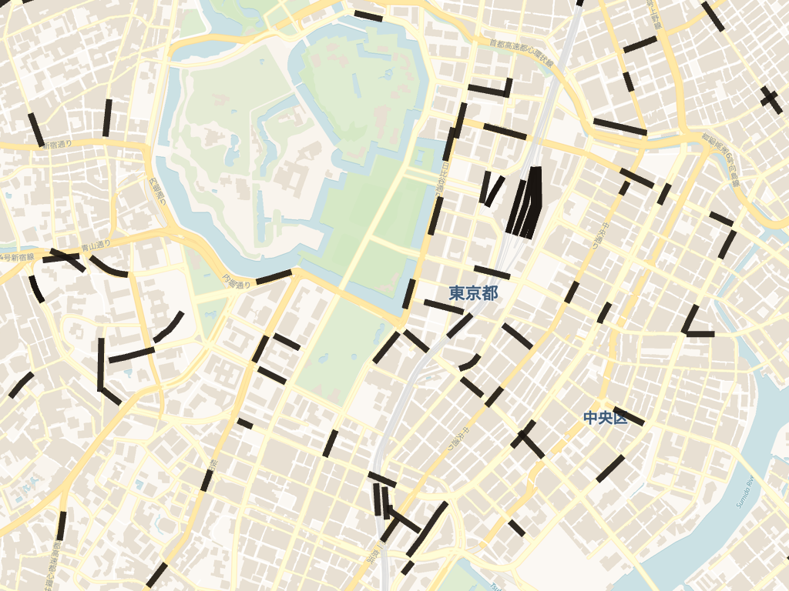
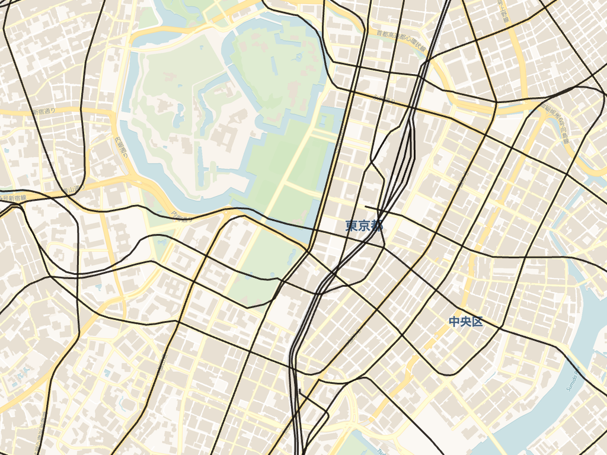
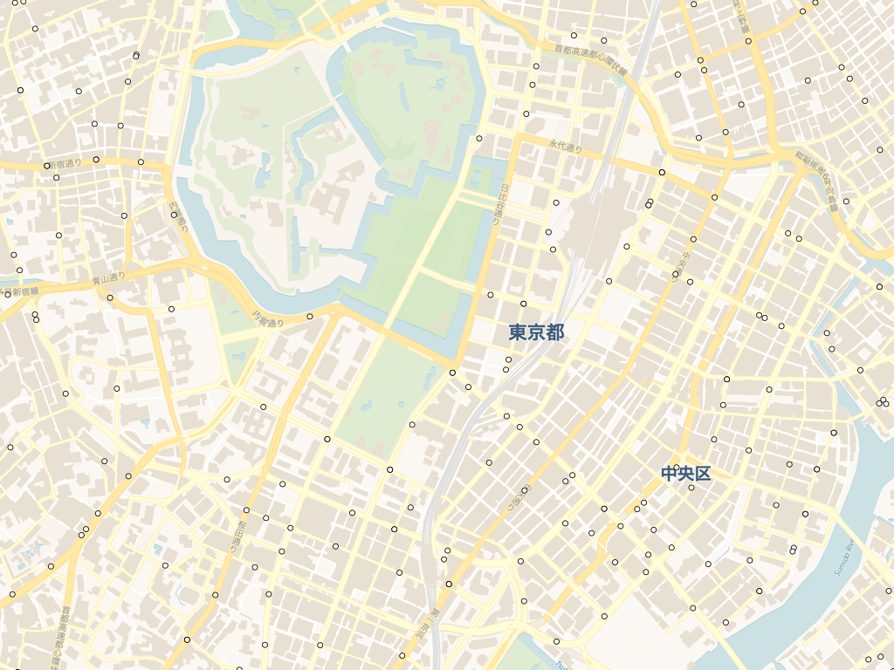
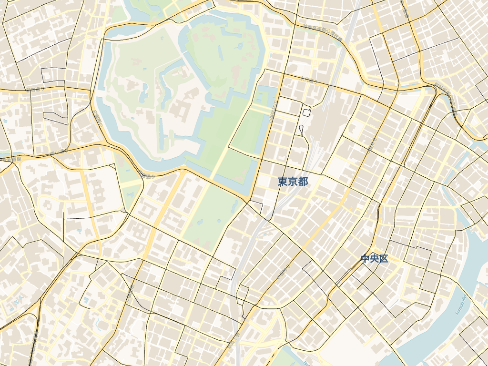
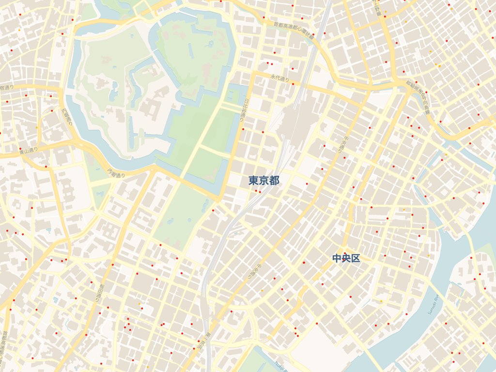
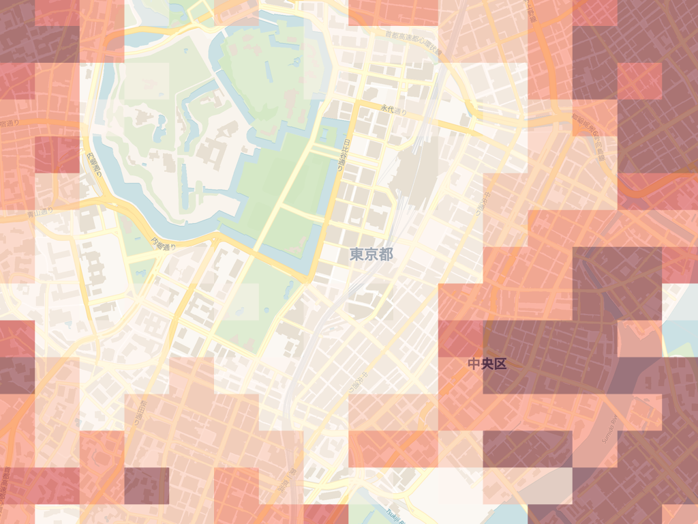
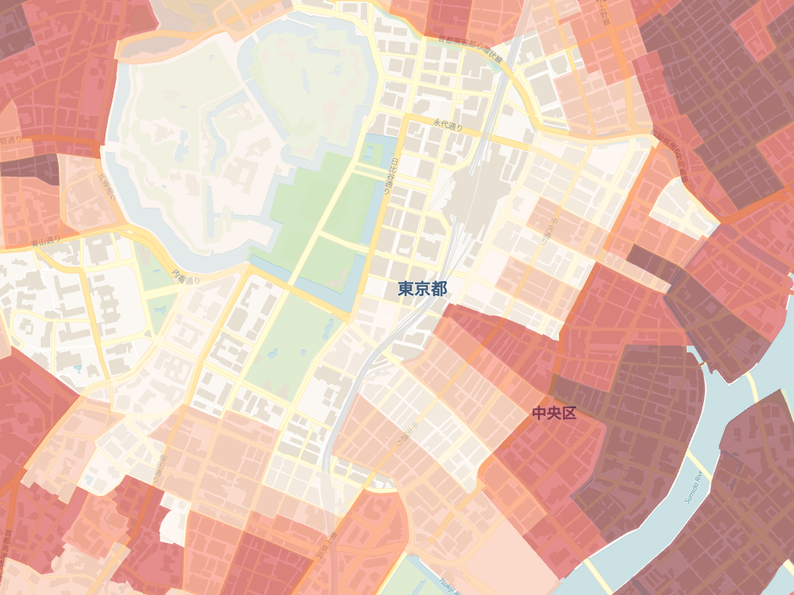
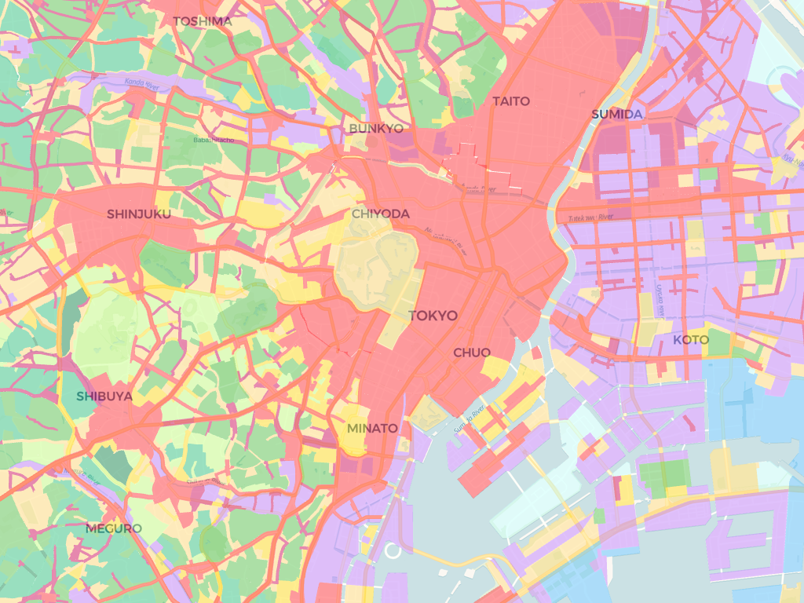
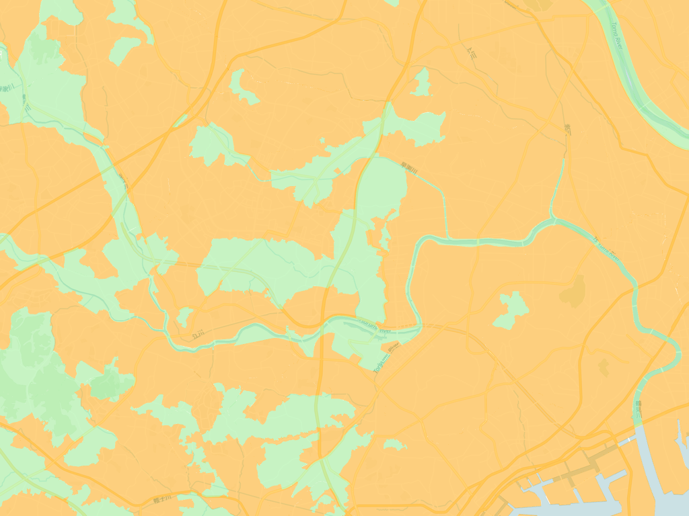
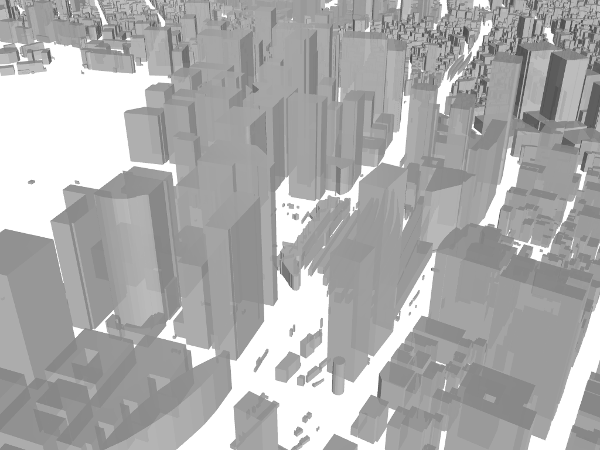

# ベクタータイル詳細

Kepler.glで利用可能なPMTiles形式のベクタータイル。各リソースはPMTiles形式で配信。

## 利用手順

1. 読み込みしたいベクタータイルのURLをコピー
2. Kepler.gl を開く
3. 「Layers / レイヤ」タブを開く
4. ポップアップ内の「Tileset」タブをクリック
5. 「Tileset URL」にコピーしたURLをペースト
6. 緑色の「Add Tileset / タイルセットを追加」をクリック

---

## 全データに共通して行った整備

配信している各ベクタータイルは、公的機関が公開する生データ（オープンデータ）を加工・整備して作成している。全データに共通する整備は次のとおり。前処理を行う背景や利用したシステムについては[ベクタータイルの前処理方法](howtotranspose.md)を参照。

- **項目名の日本語化**：記号だけの項目名（整理番号）を一つひとつ調べ、意味の分かる日本語の項目名（例：「人口」「事業者」「鉄道区分」）に付け替える。
- **コード値の文字への変換**：数字コードで格納された分類を、実際の意味を表す文字（例：「11」→「普通鉄道JR」、「1」→「民間路線バス」）に変換する。
- **地図データ（図形）の変換・座標系の統一**：特殊形式で保存された図形（境界線・地点）を地図表示できる形式へ変換し、座標系を一般的な世界測地系（緯度経度・WGS84）に統一する。
- **データ型の整備**：文字列として格納された数値項目を、集計・可視化できるよう数値へ整える。
- **行政区分などの付与**：都道府県名・市区町村名・自治体コードが含まれないデータには、図形の位置をもとに市区町村と照合して、これらを補完する。

各データセット固有の加工内容は、以下の各データセットの **前処理** に記載する。あわせて、同じ整備をQGISなどの画面操作型ソフトで手作業した場合の作業時間の目安も付記する。これは全国一括ではなく、特定の必要なエリア（例：1つの市区町村程度）に絞って作業することを想定した概算であり、作業者の習熟度や元データの状態によって変動する。

### データセット別の加工内容とQGISでの作業時間の目安

| データセット | 主な加工内容 | QGISで手作業した場合の目安 |
|---|---|---|
| 鉄道駅 | コード変換、乗降客数（13年分）の項目整理、緯度経度・地図メッシュ（H3）付与、行政区分付与、図形変換 | 約半日〜1日（4〜8時間） |
| 鉄道路線 | コード変換、項目名の整理、図形変換 | 約1〜2時間 |
| バス停留所 | 最大35系統分の集約、コード変換、緯度経度・地図メッシュ（H3）付与、行政区分付与、図形変換 | 約1日（6〜8時間） |
| バス路線 | 項目名の整理、行政区分付与、図形変換 | 約1〜2時間 |
| シェアサイクルステーション | 複数提供元データの統合、項目名・データ型の整備、行政区分付与、図形変換 | 約半日（3〜4時間） |
| メッシュ人口 | 6統計表・数百項目から約80項目を選定・項目名整理、割合・平均の指標算出、図形変換 | 約2〜3日（16〜24時間） |
| 町丁・字人口 | 複数統計表の統合、人口密度・将来推計・増減の算出、項目名整理、図形変換 | 約2〜3日（16〜24時間） |
| 都市計画用途地域 | 項目名整理、容積率・建蔽率の数値化、行政区分整備、図形変換 | 約2〜3時間 |
| 都市計画区域区分 | 項目名整理、行政区分整備、図形変換 | 約1〜2時間 |
| 3D都市モデル | 外部提供のベクタータイルをそのまま利用（前処理なし） | 対象外 |

---

## 交通

### 鉄道駅

**URL**

`https://d1ea95yc41zb9r.cloudfront.net/pmtiles/jpn_kokudo__rail_station_info_pmt.pmtiles`

**概要**

全国の鉄道駅の位置情報をラインデータとして収録したベクタータイル。JR・私鉄・地下鉄・路面電車などの駅を含み、駅名・路線名・事業者名・乗降客数等の属性を持つ。

**前処理**

- 「鉄道区分」「事業者種別」の数字コードを、意味の分かる文字に変換している。
- 生データでは年度ごとに別々の記号項目に分かれている乗降客数を、2011年〜2023年の各年として分かりやすい項目名に整理している。
- 駅名・路線・事業者・駅コードなどを日本語項目名に整理している。
- 都道府県名・市区町村名・自治体コード・緯度経度・地図メッシュ（H3）を、位置情報から付与している。
- 駅の図形（地点）を地図表示可能な形式へ変換している。

**データ定義**

| 項目名 | データ型 | 単位 | 出典 |
|--------|---------|------|------|
| 01\_駅 | STRING | - | 鉄道データ N02_005 / 駅別乗降客数データ S12_001 |
| 02\_路線 | STRING | - | 鉄道データ N02_003 / 駅別乗降客数データ S12_003 |
| 03\_事業者 | STRING | - | 鉄道データ N02_004 / 駅別乗降客数データ S12_002 |
| 04\_駅コード | STRING | - | 鉄道データ N02_005c / 駅別乗降客数データ S12_001c |
| 05\_重心駅コード | STRING | - | 鉄道データ N02_005g / 駅別乗降客数データ S12_001g |
| 06\_鉄道区分 | STRING | - | 鉄道データ N02_001 / 駅別乗降客数データ S12_004 |
| 07\_事業者種別 | STRING | - | 鉄道データ N02_002 / 駅別乗降客数データ S12_005 |
| 08\_2023年の乗降客数（人/日） | INTEGER | 人/日 | 駅別乗降客数データ S12_057 |
| 09\_2022年の乗降客数（人/日） | INTEGER | 人/日 | 駅別乗降客数データ S12_053 |
| 10\_2021年の乗降客数（人/日） | INTEGER | 人/日 | 駅別乗降客数データ S12_049 |
| 11\_2020年の乗降客数（人/日） | INTEGER | 人/日 | 駅別乗降客数データ S12_045 |
| 12\_2019年の乗降客数（人/日） | INTEGER | 人/日 | 駅別乗降客数データ S12_041 |
| 13\_2018年の乗降客数（人/日） | INTEGER | 人/日 | 駅別乗降客数データ S12_037 |
| 14\_2017年の乗降客数（人/日） | INTEGER | 人/日 | 駅別乗降客数データ S12_033 |
| 15\_2016年の乗降客数（人/日） | INTEGER | 人/日 | 駅別乗降客数データ S12_029 |
| 16\_2015年の乗降客数（人/日） | INTEGER | 人/日 | 駅別乗降客数データ S12_025 |
| 17\_2014年の乗降客数（人/日） | INTEGER | 人/日 | 駅別乗降客数データ S12_021 |
| 18\_2013年の乗降客数（人/日） | INTEGER | 人/日 | 駅別乗降客数データ S12_017 |
| 19\_2012年の乗降客数（人/日） | INTEGER | 人/日 | 駅別乗降客数データ S12_013 |
| 20\_2011年の乗降客数（人/日） | INTEGER | 人/日 | 駅別乗降客数データ S12_009 |
| 21\_JCODE | STRING | - | 加工（空間結合） |
| 22\_都道府県コード | STRING | - | 加工（空間結合） |
| 23\_都道府県 | STRING | - | 加工（空間結合） |
| 24\_市区町村 | STRING | - | 加工（空間結合） |
| 25\_H3_res9 | STRING | - | 加工（H3インデックス 解像度9） |
| 26\_H3_res10 | STRING | - | 加工（H3インデックス 解像度10） |
| 27\_H3_res11 | STRING | - | 加工（H3インデックス 解像度11） |
| 28\_緯度 | FLOAT | 度 | 加工（ジオメトリから算出） |
| 29\_経度 | FLOAT | 度 | 加工（ジオメトリから算出） |
| geometry | GEOMETRY (Point) | EPSG:4326 | 鉄道データ `_geometry` |

**元データ**
- [国土交通省国土数値情報ダウンロードサイト 鉄道データ](https://nlftp.mlit.go.jp/ksj/gml/datalist/KsjTmplt-N02-2025.html)
- [国土交通省国土数値情報ダウンロードサイト 駅別乗降客数データ](https://nlftp.mlit.go.jp/ksj/gml/datalist/KsjTmplt-S12-2024.html)

**データ作成年度**
鉄道データ：令和7年度（2025年）／駅別乗降客数データ：令和6年度（2024年）

**QGISで手作業した場合の作業時間の目安**

特定エリアに絞った場合で約半日〜1日（4〜8時間）。鉄道区分・事業者種別のコード変換に加え、年度ごとに分かれた乗降客数（13年分）の項目整理と、緯度経度・地図メッシュ（H3）の付与に手間がかかる。

**QGISの作業方法を知るための参考資料**

- [QGISでの国土数値情報利用方法](https://nlftp.mlit.go.jp/ksj/other/QGIS_manual.pdf)
- [QGISによる国土数値情報活用マニュアル](https://nlftp.mlit.go.jp/ksj/manual/manual.html)
- [国交省提供データをQGISに！国土数値情報データのダウンロードとQGISへの追加方法の解説](https://qgis.mierune.co.jp/posts/howto_1_download_ksj-data)

**ライセンス**
[CC BY 4.0](https://creativecommons.org/licenses/by/4.0/)

**配布元**
[株式会社AMANE](https://amane.ltd/)

### 鉄道路線

**URL**
`https://d1ea95yc41zb9r.cloudfront.net/pmtiles/jpn_kokudo__rail_line_pmt.pmtiles`

**概要**

全国の鉄道路線をラインデータとして収録したベクタータイル。JR・私鉄・地下鉄・路面電車などの路線を含み、路線名・事業者名・区間等の属性を持つ。

**前処理**

- 「鉄道区分」（普通鉄道JR・モノレール・軌道 など全12種）と「事業者種別」（JR新幹線・JR在来線・公営・民営・第三セクター）の数字コードを、意味の分かる文字に変換している。
- 路線名・運営会社を日本語項目名に整理している。
- 路線の図形（線）を地図表示可能な形式へ変換している。

**データ定義**

| 項目名 | データ型 | 単位 | 出典 |
|--------|---------|------|------|
| 01\_路線 | STRING | - | 鉄道データ N02_003 |
| 02\_事業者 | STRING | - | 鉄道データ N02_004 |
| 03\_鉄道区分 | STRING | - | 鉄道データ N02_001 |
| 04\_事業者種別 | STRING | - | 鉄道データ N02_002 |
| geometry | GEOMETRY (LineString) | EPSG:4326 | 鉄道データ _geometry |

**元データ**
- [国土交通省国土数値情報ダウンロードサイト 鉄道データ](https://nlftp.mlit.go.jp/ksj/gml/datalist/KsjTmplt-N02-2025.html)

**データ作成年度**
令和7年度（2025年）

**QGISで手作業した場合の作業時間の目安**

特定エリアに絞った場合で約1〜2時間。項目数が少なく、コード変換と項目名の整理が中心のため比較的短時間で済む。

**QGISの作業方法を知るための参考資料**

- [QGISでの国土数値情報利用方法](https://nlftp.mlit.go.jp/ksj/other/QGIS_manual.pdf)
- [QGISによる国土数値情報活用マニュアル](https://nlftp.mlit.go.jp/ksj/manual/manual.html)
- [国交省提供データをQGISに！国土数値情報データのダウンロードとQGISへの追加方法の解説](https://qgis.mierune.co.jp/posts/howto_1_download_ksj-data)

**ライセンス**
[CC BY 4.0](https://creativecommons.org/licenses/by/4.0/)

**配布元**
[株式会社AMANE](https://amane.ltd/)

### バス停留所

**URL**

`https://d1ea95yc41zb9r.cloudfront.net/pmtiles/jpn_kokudo__bus_stop_pmt.pmtiles`

**概要**

全国のバス停留所の位置情報をポイントデータとして収録したベクタータイル。停留所名・路線名等の属性を持つ。

**前処理**

- 生データは、1つの停留所に対して最大35系統分の「系統名」と「運行形態」が、それぞれ別々の記号項目に分かれて格納されている。
- 運行形態のコード（民間／公営／コミュニティ／その他）を、意味の分かる文字に変換している。
- 分散している系統情報を、まとめて1つの「路線系統」項目に集約し、見やすく整理している。
- 停留所名・事業者・特記事項を日本語項目名に整理している。
- 都道府県名・市区町村名・自治体コード・緯度経度・地図メッシュ（H3）を、位置情報から付与している。
- 地点の図形を地図表示可能な形式へ変換している。

**データ定義**

| 項目名 | データ型 | 単位 | 出典 |
|--------|---------|------|------|
| 01\_停留所 | STRING | - | バス停留所データ P11_001 |
| 02\_事業者 | STRING | - | バス停留所データ P11_002 |
| 03\_都道府県 | STRING | - | 加工（空間結合） |
| 04\_路線系統 | STRING | - | バス停留所データ P11_003_01〜P11_003_35 を結合 |
| 05\_特記事項 | STRING | - | バス停留所データ P11_005 |
| 06\_JCODE | STRING | - | 加工（空間結合） |
| 07\_都道府県コード | STRING | - | 加工（空間結合） |
| 08\_都道府県 | STRING | - | 加工（空間結合） |
| 09\_市区町村 | STRING | - | 加工（空間結合） |
| 10\_H3_res9 | STRING | - | 加工（H3インデックス 解像度9） |
| 11\_H3_res10 | STRING | - | 加工（H3インデックス 解像度10） |
| 12\_H3_res11 | STRING | - | 加工（H3インデックス 解像度11） |
| 13\_緯度 | FLOAT | 度 | 加工（ジオメトリから算出） |
| 14\_経度 | FLOAT | 度 | 加工（ジオメトリから算出） |
| geometry | GEOMETRY (Point) | EPSG:4326 | バス停留所データ _geometry |

**元データ**

- [国土交通省国土数値情報ダウンロードサイト バス停留所データ](https://nlftp.mlit.go.jp/ksj/gml/datalist/KsjTmplt-P11-2022.html)

**データ作成年度**
令和4年度（2022年）

**QGISで手作業した場合の作業時間の目安**

特定エリアに絞った場合で約1〜2時間。項目数が少なく、コード変換と項目名の整理が中心のため比較的短時間で済む。

**QGISの作業方法を知るための参考資料**

- [QGISでの国土数値情報利用方法](https://nlftp.mlit.go.jp/ksj/other/QGIS_manual.pdf)
- [QGISによる国土数値情報活用マニュアル](https://nlftp.mlit.go.jp/ksj/manual/manual.html)
- [国交省提供データをQGISに！国土数値情報データのダウンロードとQGISへの追加方法の解説](https://qgis.mierune.co.jp/posts/howto_1_download_ksj-data)

**ライセンス**
[CC BY 4.0](https://creativecommons.org/licenses/by/4.0/)

**配布元**
[株式会社AMANE](https://amane.ltd/)

### バス路線

**URL**

`https://d1ea95yc41zb9r.cloudfront.net/pmtiles/jpn_kokudo__bus_line_pmt.pmtiles`

**概要**

全国のバス路線をラインデータとして収録したベクタータイル。事業者名等の属性を持つ。

**前処理**

- 生データにはバス事業者名と特記事項のみが記号項目で含まれている。これらを日本語項目名に整理している。
- 路線の図形（線）を地図表示可能な形式へ変換している。
- 生データに含まれない都道府県名・市区町村名・自治体コードを、位置情報から照合して付与している。

**データ定義**

| 項目名 | データ型 | 単位 | 出典 |
|--------|---------|------|------|
| 01\_事業者 | STRING | - | バスルートデータ N07_001 |
| 02\_特記事項 | STRING | - | バスルートデータ N07_002 |
| 03\_都道府県 | STRING | - | 加工（空間結合） |
| 04\_市区町村 | STRING | - | 加工（空間結合） |
| 05\_JCODE | STRING | - | 加工（空間結合） |
| 06\_都道府県コード | STRING | - | 加工（空間結合） |
| geometry | GEOMETRY (LineString) | EPSG:4326 | バスルートデータ _geometry |

**元データ**

- [国土交通省国土数値情報ダウンロードサイト バスルートデータ](https://nlftp.mlit.go.jp/ksj/gml/datalist/KsjTmplt-N07-2022.html)

**データ作成年度**
令和4年度（2022年）

**QGISで手作業した場合の作業時間の目安**

特定エリアに絞った場合で約1〜2時間。項目が少なく、項目名の整理と行政区分の空間結合が中心のため比較的短時間で済む。

**QGISの作業方法を知るための参考資料**

- [QGISでの国土数値情報利用方法](https://nlftp.mlit.go.jp/ksj/other/QGIS_manual.pdf)
- [QGISによる国土数値情報活用マニュアル](https://nlftp.mlit.go.jp/ksj/manual/manual.html)
- [国交省提供データをQGISに！国土数値情報データのダウンロードとQGISへの追加方法の解説](https://qgis.mierune.co.jp/posts/howto_1_download_ksj-data)

**ライセンス**
[CC BY 4.0](https://creativecommons.org/licenses/by/4.0/)

**配布元**
[株式会社AMANE](https://amane.ltd/)

### シェアサイクルステーション

**URL**

`https://d1ea95yc41zb9r.cloudfront.net/pmtiles/jpn_sharecycle__station_pmt.pmtiles`

**概要**

全国のシェアサイクルステーションの位置情報をポイントデータとして収録したベクタータイル。OpenStreet・ドコモ・バイクシェア等のサービスを含み、ステーション名・収容台数等の属性を持つ。

**前処理**

- 複数の提供元のステーション情報を1つに統合している。
- ステーション名・事業者・収容台数・最終更新日などを日本語項目名に整理している。
- 収容台数や緯度・経度を、集計・地図表示できるよう数値に整えている。
- 都道府県名・市区町村名・自治体コードを、位置情報から付与している。
- ステーションの図形（地点）を地図表示可能な形式へ変換している。

**データ定義**

| 項目名 | データ型 | 単位 | 出典 |
|--------|---------|------|------|
| 01\_ステーション名 | STRING | - | GBFS name |
| 02\_事業者 | STRING | - | 加工（データソースから判定） |
| 03\_収容台数 | INTEGER | 台 | GBFS vehicle_capacity |
| 04\_都道府県 | STRING | - | 加工（空間結合） |
| 05\_都道府県コード | STRING | - | 加工（空間結合） |
| 06\_市区町村 | STRING | - | 加工（空間結合） |
| 07\_JCODE | STRING | - | 加工（空間結合） |
| 08\_緯度 | FLOAT | 度 | GBFS lat |
| 09\_経度 | FLOAT | 度 | GBFS lon |
| 10\_最終更新日 | STRING | - | GBFS _last_updated |
| geometry | GEOMETRY (Point) | EPSG:4326 | 加工（緯度経度から生成） |

**元データ**
- [公共交通オープンデータセンター OpenStreet バイクシェア関連情報(station_information)](https://ckan.odpt.org/dataset/c_bikeshare_gbfs-openstreet/resource/d45e9650-b243-4f5a-bda6-c2b0cb61e8a3)
- [公共交通オープンデータセンター ドコモ・バイクシェア バイクシェア関連情報(station_information)](https://ckan.odpt.org/dataset/c_bikeshare_gbfs-d-nationwide-bikeshare/resource/addf55c2-d764-4d2c-9a89-f2a610663953)

**データ作成年度**
2025年取得時点（GBFSリアルタイムデータ）

**QGISで手作業した場合の作業時間の目安**

特定エリアに絞った場合で約半日（3〜4時間）。複数の提供元データを1つに統合し、項目名・型をそろえる作業に手間がかかる。

**QGISの作業方法を知るための参考資料**

- [モビリティオープンデータの活用手引 ～QGISでシェアサイクルを見てみよう～](https://speakerdeck.com/hiskoh/mobiriteiopundetanohuo-yong-shou-yin-qgisdesieasaikuruwojian-temiyou)
- [QGISでシェアサイクルデータGBFSを見てみよう！](https://qiita.com/hiskoh/items/a2df472b6ad5a21a5c51)

**ライセンス**
[CC BY 4.0](https://creativecommons.org/licenses/by/4.0/)

**配布元**
[株式会社AMANE](https://amane.ltd/)

---

## 人口統計

### メッシュ人口

**URL**

`https://d1ea95yc41zb9r.cloudfront.net/pmtiles/jpn_census2020_mesh5__all_pmt.pmtiles`

**概要**

令和2年国勢調査に基づく250mメッシュ(5次メッシュ)単位の人口データをポリゴンとして収録したベクタータイル。メッシュごとの総人口・世帯数等の属性を持つ。

**前処理**

- 生データは、人口・世帯、年齢別人口、住宅・建物、就業状態、就業形態・教育・居住期間、5年前の常住地など、6種類の統計表にまたがる数百項目の記号列で構成されている。
- これらを一つひとつ日本語項目名に整理し、実際に必要な約80項目を厳選して収録している。
- 「15歳未満人口の割合(%)」「65歳以上人口の割合(%)」「1世帯当たり人員」など、生データには存在しない割合・平均の指標を新たに算出して追加している。
- メッシュ（網の目状の区画）ごとの境界図形を、地図表示可能な形式に変換している。
- ※特に項目数が多く、統計表ごとの記号体系を照合する作業に手間を要したデータである。

**データ定義**

**A: 人口**

| 項目名 | データ型 | 単位 | 出典 |
|--------|---------|------|------|
| A01\_メッシュコード | STRING | - | 令和2年国勢調査 KEY_CODE |
| A02\_人口 | INTEGER | 人 | 令和2年国勢調査 T001102001 |
| A03\_人口_男 | INTEGER | 人 | 令和2年国勢調査 T001102002 |
| A04\_人口_女 | INTEGER | 人 | 令和2年国勢調査 T001102003 |
| A05\_平均年齢 | FLOAT | 歳 | 令和2年国勢調査 T001175064 |
| A06\_年齢中位数 | FLOAT | 歳 | 令和2年国勢調査 T001175065 |
| A07\_15歳未満人口 | INTEGER | 人 | 令和2年国勢調査 T001102004 |
| A08\_15〜64歳人口 | INTEGER | 人 | 令和2年国勢調査 T001102010 |
| A09\_65歳以上人口 | INTEGER | 人 | 令和2年国勢調査 T001102019 |
| A10\_75歳以上人口 | INTEGER | 人 | 令和2年国勢調査 T001102022 |
| A11\_15歳未満人口割合（%） | FLOAT | % | 加工（算出） |
| A12\_15〜64歳人口割合（%） | FLOAT | % | 加工（算出） |
| A13\_65歳以上人口割合（%） | FLOAT | % | 加工（算出） |
| A14\_75歳以上人口割合（%） | FLOAT | % | 加工（算出） |

**B: 世帯**

| 項目名 | データ型 | 単位 | 出典 |
|--------|---------|------|------|
| B01\_世帯 | INTEGER | 世帯 | 令和2年国勢調査 T001102034 |
| B02\_世帯当たり人員 | FLOAT | 人/世帯 | 加工（算出） |
| B03\_単身世帯 | INTEGER | 世帯 | 令和2年国勢調査 T001102036 |
| B04\_6歳未満がいる世帯 | INTEGER | 世帯 | 令和2年国勢調査 T001102046 |
| B05\_65歳以上がいる世帯 | INTEGER | 世帯 | 令和2年国勢調査 T001102047 |
| B06\_20_29歳単身世帯 | INTEGER | 世帯 | 令和2年国勢調査 T001102048 |
| B07\_高齢単身世帯 | INTEGER | 世帯 | 令和2年国勢調査 T001102049 |
| B08\_高齢夫婦世帯 | INTEGER | 世帯 | 令和2年国勢調査 T001102050 |
| B09\_持ち家世帯 | INTEGER | 世帯 | 令和2年国勢調査 T001186002 |
| B10\_公営・都市再生機構・公社の借家世帯 | INTEGER | 世帯 | 令和2年国勢調査 T001186003 |
| B11\_民営の借家世帯 | INTEGER | 世帯 | 令和2年国勢調査 T001186004 |
| B12\_給与住宅世帯 | INTEGER | 世帯 | 令和2年国勢調査 T001186005 |
| B13\_一戸建世帯 | INTEGER | 世帯 | 令和2年国勢調査 T001186007 |
| B14\_共同住宅世帯 | INTEGER | 世帯 | 令和2年国勢調査 T001186009 |

**C: 就業**

| 項目名 | データ型 | 単位 | 出典 |
|--------|---------|------|------|
| C01\_雇用者 | INTEGER | 人 | 令和2年国勢調査 T001109001 |
| C02\_正規の職員・従業員 | INTEGER | 人 | 令和2年国勢調査 T001109004 |
| C03\_労働者派遣事業所の派遣社員 | INTEGER | 人 | 令和2年国勢調査 T001109007 |
| C04\_パート・アルバイト・その他 | INTEGER | 人 | 令和2年国勢調査 T001109010 |
| C05\_労働力人口 | INTEGER | 人 | 令和2年国勢調査 T001185001 |
| C06\_完全失業者人口 | INTEGER | 人 | 令和2年国勢調査 T001185007 |
| C07\_非労働力人口 | INTEGER | 人 | 令和2年国勢調査 T001185010 |
| C08\_第１次産業従事者 | INTEGER | 人 | 令和2年国勢調査 T001185013 |
| C09\_第２次産業従事者 | INTEGER | 人 | 令和2年国勢調査 T001185022 |
| C10\_第３次産業従事者 | INTEGER | 人 | 令和2年国勢調査 T001185034 |
| C11\_未就学者 | INTEGER | 人 | 令和2年国勢調査 T001109019 |
| C12\_在学者 | INTEGER | 人 | 令和2年国勢調査 T001109034 |

**D: 居住期間**

| 項目名 | データ型 | 単位 | 出典 |
|--------|---------|------|------|
| D01\_居住期間出生時から | INTEGER | 人 | 令和2年国勢調査 T001109064 |
| D02\_居住期間1年未満 | INTEGER | 人 | 令和2年国勢調査 T001109067 |
| D03\_居住期間1〜5年未満 | INTEGER | 人 | 令和2年国勢調査 T001109070 |
| D04\_居住期間5〜10年未満 | INTEGER | 人 | 令和2年国勢調査 T001109073 |
| D05\_居住期間10〜20年未満 | INTEGER | 人 | 令和2年国勢調査 T001109076 |
| D06\_居住期間20年以上 | INTEGER | 人 | 令和2年国勢調査 T001109079 |

**E: 通勤通学**

| 項目名 | データ型 | 単位 | 出典 |
|--------|---------|------|------|
| E01\_就業者・通学者 | INTEGER | 人 | 令和2年国勢調査 T001187037 |
| E02\_従業地_自宅 | INTEGER | 人 | 令和2年国勢調査 T001187040 |
| E03\_従業通学地_自宅外の自市区町村 | INTEGER | 人 | 令和2年国勢調査 T001187041 |
| E04\_従業通学地_自市内他区or県内他市町村 | INTEGER | 人 | 令和2年国勢調査 T001187044 |
| E05\_従業通学地_他県 | INTEGER | 人 | 令和2年国勢調査 T001187047 |
| E06\_従業地_自宅の割合（%） | FLOAT | % | 加工（算出） |
| E07\_従業通学地_自宅外の自市区町村の割合（%） | FLOAT | % | 加工（算出） |
| E08\_従業通学地_自市内他区or県内他市町村の割合（%） | FLOAT | % | 加工（算出） |
| E09\_従業通学地_他県の割合（%） | FLOAT | % | 加工（算出） |
| E10\_徒歩のみ | INTEGER | 人 | 令和2年国勢調査 T001187050 |
| E11\_鉄道・電車 | INTEGER | 人 | 令和2年国勢調査 T001187051 |
| E12\_乗合バス | INTEGER | 人 | 令和2年国勢調査 T001187052 |
| E13\_自家用車 | INTEGER | 人 | 令和2年国勢調査 T001187053 |
| E14\_オートバイ | INTEGER | 人 | 令和2年国勢調査 T001187054 |
| E15\_自転車 | INTEGER | 人 | 令和2年国勢調査 T001187055 |
| E16\_勤め先・学校のバス | INTEGER | 人 | 令和2年国勢調査 T001187056 |
| E17\_ハイヤー・タクシー | INTEGER | 人 | 令和2年国勢調査 T001187057 |
| E18\_徒歩のみの割合（%） | FLOAT | % | 加工（算出） |
| E19\_鉄道・電車の割合（%） | FLOAT | % | 加工（算出） |
| E20\_乗合バスの割合（%） | FLOAT | % | 加工（算出） |
| E21\_自家用車の割合（%） | FLOAT | % | 加工（算出） |
| E22\_オートバイの割合（%） | FLOAT | % | 加工（算出） |
| E23\_自転車の割合（%） | FLOAT | % | 加工（算出） |
| E24\_勤め先・学校のバスの割合（%） | FLOAT | % | 加工（算出） |
| E25\_ハイヤー・タクシーの割合（%） | FLOAT | % | 加工（算出） |

**F: 5年前の居住地**

| 項目名 | データ型 | 単位 | 出典 |
|--------|---------|------|------|
| F01\_現在の常住者 | INTEGER | 人 | 令和2年国勢調査 T001187001 |
| F02\_5年前から現住所 | INTEGER | 人 | 令和2年国勢調査 T001187004 |
| F03\_5年前から転居 | INTEGER | 人 | 令和2年国勢調査 T001187007 |
| F04\_5年前に自市町村内から転居 | INTEGER | 人 | 令和2年国勢調査 T001187010 |
| F05\_5年前に県内他市町村から転居 | INTEGER | 人 | 令和2年国勢調査 T001187013 |
| F06\_5年前に他県・国外から転居 | INTEGER | 人 | 令和2年国勢調査 T001187016 |
| F07\_現住所総数の割合（%） | FLOAT | % | 加工（算出） |
| F08\_移動あり総数の割合（%） | FLOAT | % | 加工（算出） |
| F09\_自市町村内から総数の割合（%） | FLOAT | % | 加工（算出） |
| F10\_県内他市町村から総数の割合（%） | FLOAT | % | 加工（算出） |
| F11\_他県・国外から総数の割合（%） | FLOAT | % | 加工（算出） |

**GEOMETRY**

| 項目名 | データ型 | 単位 | 出典 |
|--------|---------|------|------|
| geometry | GEOMETRY (Polygon) | EPSG:4326 | 令和2年国勢調査 境界データ _geometry |

**元データ**
- 総務省「令和2年国勢調査」 世界測地系（JGD2011）250mメッシュ

**データ作成年度**
令和2年（2020年）

**QGISで手作業した場合の作業時間の目安**

特定エリアに絞った場合でも約2〜3日（16〜24時間）。図形の量はエリアを絞れば減るものの、6種類の統計表にわたる数百項目から必要な約80項目を選び、一つひとつ項目名を整理し、割合・平均などの指標を算出する作業はエリアを絞っても軽減されず、最も手間のかかるデータである。

**QGISの作業方法を知るための参考資料**
- [国勢調査結果をQGISで表示する手順を画像で解説：無料でGISを使ってみる](https://lemulus.me/trygis/census-import)
- [不動産市場動向等の面的データの地域における活用手法に係るガイドライン 参考資料　分析手順の詳細解説集　テーマ３](https://www.mlit.go.jp/tochi_fudousan_kensetsugyo/content/001400816.pdf)
- [不動産市場動向等の面的データの地域における活用手法に係るガイドライン](https://www.mlit.go.jp/tochi_fudousan_kensetsugyo/tochi_fudousan_kensetsugyo_fr5_000001_00006.html)

**ライセンス**
[PDL1.0](https://www.digital.go.jp/resources/open_data/public_data_license_v1.0)

**配布元**
[株式会社AMANE](https://amane.ltd/)

### 町丁・字人口

**URL**

`https://d1ea95yc41zb9r.cloudfront.net/pmtiles/jpn_census2020_town__map_with_all_pmt.pmtiles`

**概要**

令和2年国勢調査に基づく町丁・字等の境界単位の人口データをポリゴンとして収録したベクタータイル。町丁目ごとの総人口・世帯数等の属性を持つ。

**前処理**

- 人口・年齢、世帯構成、世帯人員、世帯の経済構成、住宅の建て方、持ち家／借家、産業別・職業別の就業者数など、複数の統計表を町丁・字の区画コードで突き合わせて1つに統合している。
- 各統計表それぞれで、記号列の項目名を日本語へ整理している。
- 面積をもとに人口密度（1平方kmあたり）を算出している。
- 2025年の推計人口を別途用意し、2020年国勢調査との増減（人数・密度の差分）を算出して追加している。
- 「15歳未満・65歳以上などの人口割合(%)」を新たに算出している。
- ※複数統計表の統合と、将来推計・増減指標の算出を伴う、加工量の多いデータである。

**データ定義**

**A: 地域・人口**

| 項目名 | データ型 | 単位 | 出典 |
|--------|---------|------|------|
| A01\_KEY_CODE | STRING | - | 令和2年国勢調査 境界データ KEY_CODE |
| A02\_JCODE | STRING | - | 加工（KEY_CODE から算出） |
| A03\_都道府県コード | STRING | - | 令和2年国勢調査 境界データ PREF |
| A04\_都道府県 | STRING | - | 令和2年国勢調査 境界データ PREF_NAME |
| A05\_市区町村 | STRING | - | 令和2年国勢調査 境界データ CITY_NAME |
| A06\_町丁・字 | STRING | - | 令和2年国勢調査 境界データ S_NAME |
| A07\_分類コード | STRING | - | 令和2年国勢調査 境界データ HCODE |
| A08\_面積（㎡） | FLOAT | ㎡ | 令和2年国勢調査 境界データ AREA |
| A09\_人口 | INTEGER | 人 | 令和2年国勢調査 T001081001 |
| A10\_人口（2025推計） | INTEGER | 人 | 加工（推計） |
| A11\_人口増減（2025-2020） | INTEGER | 人 | 加工（推計） |
| A12\_人口密度（人／㎢） | FLOAT | 人/㎢ | 加工（算出） |
| A13\_人口密度（2025推計） | FLOAT | 人/㎢ | 加工（推計） |
| A14\_人口密度増減 | FLOAT | 人/㎢ | 加工（推計） |
| A15\_15歳未満人口 | INTEGER | 人 | 令和2年国勢調査 T001082017 |
| A16\_15〜64歳人口 | INTEGER | 人 | 令和2年国勢調査 T001082018 |
| A17\_65歳以上人口 | INTEGER | 人 | 令和2年国勢調査 T001082019 |
| A18\_75歳以上人口 | INTEGER | 人 | 令和2年国勢調査 T001082020 |
| A19\_15歳未満人口割合（%） | FLOAT | % | 加工（算出） |
| A20\_15〜64歳人口割合（%） | FLOAT | % | 加工（算出） |
| A21\_65歳以上人口割合（%） | FLOAT | % | 加工（算出） |
| A22\_75歳以上人口割合（%） | FLOAT | % | 加工（算出） |

**B: 世帯**

| 項目名 | データ型 | 単位 | 出典 |
|--------|---------|------|------|
| B01\_世帯 | INTEGER | 世帯 | 令和2年国勢調査 T001083001 |
| B02\_世帯当たり人員 | FLOAT | 人/世帯 | 令和2年国勢調査 T001083008 |
| B03\_単身世帯 | INTEGER | 世帯 | 令和2年国勢調査 T001083002 |
| B04\_6歳未満がいる世帯 | INTEGER | 世帯 | 令和2年国勢調査 T001084007 |
| B05\_18歳未満がいる世帯 | INTEGER | 世帯 | 令和2年国勢調査 T001084008 |
| B06\_65歳以上がいる世帯 | INTEGER | 世帯 | 令和2年国勢調査 T001084009 |

**C: 住居**

| 項目名 | データ型 | 単位 | 出典 |
|--------|---------|------|------|
| C01\_持ち家 | INTEGER | 世帯 | 令和2年国勢調査 T001085002 |
| C02\_民営借家 | INTEGER | 世帯 | 令和2年国勢調査 T001085003 |
| C03\_一戸建 | INTEGER | 世帯 | 令和2年国勢調査 T001086002 |
| C04\_共同住宅 | INTEGER | 世帯 | 令和2年国勢調査 T001086004 |

**D: 就業**

| 項目名 | データ型 | 単位 | 出典 |
|--------|---------|------|------|
| D01\_従業者数 | INTEGER | 人 | 令和2年国勢調査 T001103001 |
| D02\_第１次産業従事者 | INTEGER | 人 | 加工（産業分類別就業者数から算出） |
| D03\_第２次産業従事者 | INTEGER | 人 | 加工（産業分類別就業者数から算出） |
| D04\_第３次産業従事者 | INTEGER | 人 | 加工（産業分類別就業者数から算出） |

**GEOMETRY**

| 項目名 | データ型 | 単位 | 出典 |
|--------|---------|------|------|
| geometry | GEOMETRY (Polygon) | EPSG:4326 | 令和2年国勢調査 境界データ _geometry |

**元データ**
- 総務省「令和2年国勢調査」 町丁・字等集計

**データ作成年度**
令和2年（2020年）

**QGISで手作業した場合の作業時間の目安**

特定エリアに絞った場合でも約2〜3日（16〜24時間）。複数の統計表を区画コードで突き合わせて統合する作業に加え、人口密度・将来推計・増減など元データにない指標を算出する必要があり、これらはエリアを絞っても手間が軽減されない。

**QGISの作業方法を知るための参考資料**
- [国勢調査結果をQGISで表示する手順を画像で解説：無料でGISを使ってみる](https://lemulus.me/trygis/census-import)
- [不動産市場動向等の面的データの地域における活用手法に係るガイドライン 参考資料　分析手順の詳細解説集　テーマ３](https://www.mlit.go.jp/tochi_fudousan_kensetsugyo/content/001400816.pdf)
- [不動産市場動向等の面的データの地域における活用手法に係るガイドライン](https://www.mlit.go.jp/tochi_fudousan_kensetsugyo/tochi_fudousan_kensetsugyo_fr5_000001_00006.html)

**ライセンス**
[PDL1.0](https://www.digital.go.jp/resources/open_data/public_data_license_v1.0)

**配布元**
[株式会社AMANE](https://amane.ltd/)

---

## 都市計画

### 都市計画用途地域

**URL**

`https://d1ea95yc41zb9r.cloudfront.net/pmtiles/jpn_kokudo__toshikeikaku_youto_pmt.pmtiles`

**概要**

全国の都市計画用途地域をポリゴンとして収録したベクタータイル。第一種低層住居専用地域・商業地域・工業地域など13種の用途地域区分や建ぺい率・容積率等の属性を持つ。

**前処理**

- 用途地域名や当初決定日・最終告示日などを日本語項目名に整理している。
- 容積率・建蔽率を、集計・比較できるよう文字列から数値に整えている。
- 用途地域の図形（面）を地図表示可能な形式へ変換している。
- 都道府県名・市区町村名・自治体コードを整備している。

**データ定義**

| 項目名 | データ型 | 単位 | 出典 |
|--------|---------|------|------|
| 01\_用途地域 | STRING | - | 都市計画決定情報データ YoutoName |
| 02\_用途地域コード | STRING | - | 都市計画決定情報データ YoutoCode |
| 03\_容積率 | FLOAT | % | 都市計画決定情報データ FAR |
| 04\_建蔽率 | FLOAT | % | 都市計画決定情報データ BCR |
| 05\_当初決定日 | STRING | - | 都市計画決定情報データ INDate |
| 06\_最終告示日 | STRING | - | 都市計画決定情報データ FNDate |
| 07\_都道府県コード | STRING | - | 加工（Citycode から算出） |
| 08\_JCODE | STRING | - | 都市計画決定情報データ Citycode |
| 09\_都道府県 | STRING | - | 都市計画決定情報データ Pref |
| 10\_市区町村 | STRING | - | 都市計画決定情報データ Cityname |
| geometry | GEOMETRY (Polygon) | EPSG:4326 | 都市計画決定情報データ _geometry |

**元データ**
- [国土交通省国土数値情報ダウンロードサイト 都市計画決定情報データ](https://nlftp.mlit.go.jp/ksj/gml/datalist/KsjTmplt-A55-2024.html)

**データ作成年度**
令和6年度（2024年）

**QGISで手作業した場合の作業時間の目安**

特定エリアに絞った場合で約2〜3時間。項目名の整理と、容積率・建蔽率の数値化、行政区分の整備が中心。

**QGISの作業方法を知るための参考資料**
- [QGISでの国土数値情報利用方法](https://nlftp.mlit.go.jp/ksj/other/QGIS_manual.pdf)
- [QGISによる国土数値情報活用マニュアル](https://nlftp.mlit.go.jp/ksj/manual/manual.html)
- [国交省提供データをQGISに！国土数値情報データのダウンロードとQGISへの追加方法の解説](https://qgis.mierune.co.jp/posts/howto_1_download_ksj-data)

**ライセンス**
[CC BY 4.0](https://creativecommons.org/licenses/by/4.0/)

**配布元**
[株式会社AMANE](https://amane.ltd/)

### 都市計画区域区分

**URL**

`https://d1ea95yc41zb9r.cloudfront.net/pmtiles/jpn_kokudo__toshikeikaku_senbiki_pmt.pmtiles`

**概要**

全国の都市計画区域区分（線引き）をポリゴンとして収録したベクタータイル。市街化区域・市街化調整区域の区分属性を持つ。

**前処理**

- 区域区分（市街化区域・市街化調整区域）や当初決定日・最終告示日などを日本語項目名に整理している。
- 区域の図形（面）を地図表示可能な形式へ変換している。
- 都道府県名・市区町村名・自治体コードを整備している。

**データ定義**

| 項目名 | データ型 | 単位 | 出典 |
|--------|---------|------|------|
| 01\_区域区分 | STRING | - | 都市計画決定情報データ AreaType |
| 02\_区域区分コード | STRING | - | 都市計画決定情報データ AreaCode |
| 03\_当初決定日 | STRING | - | 都市計画決定情報データ INDate |
| 04\_最終告示日 | STRING | - | 都市計画決定情報データ FNDate |
| 05\_都道府県コード | STRING | - | 加工（Citycode から算出） |
| 06\_JCODE | STRING | - | 都市計画決定情報データ Citycode |
| 07\_都道府県 | STRING | - | 都市計画決定情報データ Pref |
| 08\_市区町村 | STRING | - | 都市計画決定情報データ Cityname |
| geometry | GEOMETRY (Polygon) | EPSG:4326 | 都市計画決定情報データ _geometry |

**元データ**
- [国土交通省国土数値情報ダウンロードサイト 都市計画決定情報データ](https://nlftp.mlit.go.jp/ksj/gml/datalist/KsjTmplt-A55-2024.html)

**データ作成年度**
令和6年度（2024年）

**QGISで手作業した場合の作業時間の目安**

特定エリアに絞った場合で約1〜2時間。項目が少なく、項目名の整理と行政区分の整備が中心のため比較的短時間で済む。

**QGISの作業方法を知るための参考資料**
- [QGISでの国土数値情報利用方法](https://nlftp.mlit.go.jp/ksj/other/QGIS_manual.pdf)
- [QGISによる国土数値情報活用マニュアル](https://nlftp.mlit.go.jp/ksj/manual/manual.html)
- [国交省提供データをQGISに！国土数値情報データのダウンロードとQGISへの追加方法の解説](https://qgis.mierune.co.jp/posts/howto_1_download_ksj-data)

**ライセンス**
[CC BY 4.0](https://creativecommons.org/licenses/by/4.0/)

**配布元**
[株式会社AMANE](https://amane.ltd/)

---

## 3D都市モデル

### 3D都市モデル（PLATEAU 2023 LOD0）

**URL**

`https://shiworks.xsrv.jp/pmtiles-data/plateau/PLATEAU_2023_LOD0.pmtiles`

**概要**

国土交通省Project PLATEAUの2023年度整備データをLOD0（建物フットプリント）としてポリゴンで収録したベクタータイル。建物の用途・構造等の属性を持つ。

**前処理**

- 本データは外部の提供者が公開しているベクタータイルをそのまま利用しており、上記の前処理は行っていない。加工内容・出典は配布元を参照。

**元データ**
- https://github.com/shiwaku/mlit-plateau-bldg-pmtiles

**データ作成年度**
令和5年度（2023年）

**QGISで手作業した場合の作業時間の目安**

前処理を行っていないため対象外。

**QGISの作業方法を知るための参考資料**
- [TOPIC20｜QGISプラグインを使って3D都市モデルを可視化する[1/2]｜PLATEAU QGIS Pluginのインストール](https://www.mlit.go.jp/plateau/learning/tpc20-1/)

**ライセンス**
[CC BY 4.0](https://creativecommons.org/licenses/by/4.0/)

**配布元**
[shiwaku (Yohei Shiwaku)](https://github.com/shiwaku)
